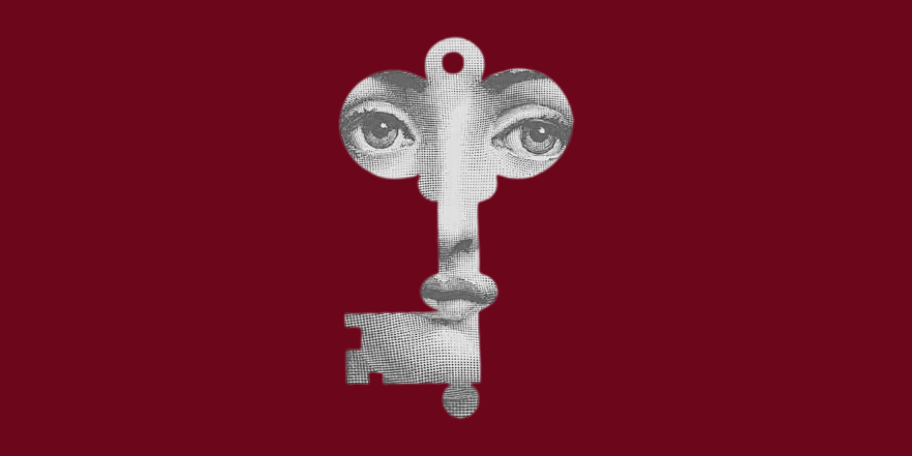

  

<h2 align="center"> Hi there, I'm Sameh Sellami!</h2>

  💻 Computer Science Student | 🚀 Entrepreneurial Spirit | 🌱 Tech Innovator

  

---

## About Me

I'm a passionate Computer Science student with an entrepreneurial mindset, dedicated to turning innovative ideas into impactful digital solutions. I love creating smart applications that solve real-world problems!

> *"Driven by the will to create useful and impactful solutions, I dive deep into building intelligent platforms that make a difference."*

---

<h3 align="center">Languages and Tools:</h3> 

 
   
   
   
   
   
   
   
   
   
   
   
   
   
   
   
   

---

## GitHub Analytics  

  

  

  

---

## 🚀 Current Focus

- 🔭 **Building:** Intelligent applications with Spring Boot & Android
- 🌱 **Learning:** Advanced software architecture & AI integration
- 👯 **Collaborating:** On innovative web/mobile projects
- 💡 **Exploring:** Startup opportunities in tech innovation
- 🎯 **Goal:** Create solutions that bridge technology and real-world needs

---

## Let's Connect & Collaborate!

---

## Fun Facts & Philosophy

> *"Clean code is not just about working software, it's about creating solutions that are maintainable, scalable, and make a real impact."*

**Quick Facts:**
- 🌍 **Languages:** French, English, Arabic
- 🎨 **Passions:** Technology, Innovation, Entrepreneurship
- ✨ **Motto:** *"Transforming ideas into impactful projects, one line of code at a time."*

---

---

---

### Thanks for visiting

> *"The best way to predict the future is to invent it."*  
> ― Alan Kay

**Sameh Sellami**

